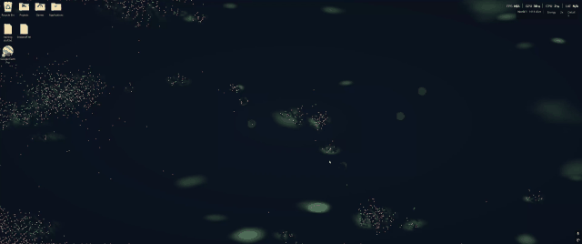

# Primitive World

**A living artificial-life experiment for your Windows desktop.**

Primitive World is a local, GPU-powered ecology where small neural agents must
find food, spend energy, reproduce, communicate, and survive changing terrain.
There is no pretrained model, cloud service, or authored strategy—just a world
whose consequences decide what persists.

[](assets/primitive-world-demo.mp4)

*Autoplaying preview — click for the full 1080p video. [Watch the original Reddit post.](https://www.reddit.com/r/ArtificialInteligence/comments/1waf33e/running_an_ecology_survival_simulation_experiment/)*

## Make it your wallpaper

Primitive World currently targets **Windows**. Install [Rust 1.93.1 or newer](https://www.rust-lang.org/tools/install), use a GPU/driver with wgpu compute support, then clone this repository and build once:

```powershell
.\Build.cmd
```

Double-click **Primitive World.exe** in the project folder. It resumes your newest
compatible saved experiment as wallpaper, or starts one if there are no saves.
There is no terminal to keep open. The executable is self-contained and can also
be copied to a permanent folder before enabling startup.

Right-click its icon in the Windows notification area (possibly inside the **^**
overflow) for **Pause simulation / Resume simulation**, **Save now**, **Open saves
folder**, **Start this copy with Windows**, and **Save and quit**. Startup is opt-in;
the checkbox registers this executable for your Windows account without admin
rights. Selecting it from a different copy updates the registered path.

A small desktop HUD shows population and world state; use its menus to change
the lens or biological speed. Click empty habitat to add food.

For source updates, run `Build.cmd` again after **Save and quit**. For a regular
window with New Game / Load Game, double-click `Play.cmd` or run
`cargo run --release -- --viewer`. Developer commands remain available:

```powershell
.\Play.cmd --wallpaper --resume
.\Play.cmd --install-startup
.\Play.cmd --uninstall-startup
```

`Play.cmd --wallpaper --resume` builds and launches the app, then returns so you
can close the terminal. Headless and maintenance commands wait for completion
and preserve output and exit codes. The detailed [wallpaper guide](docs/play.md)
covers saves, controls, desktop behavior, and recovery.

## What is happening in the world?

Each tick is simulated on the GPU. Food grows and shifts across a toroidal world:
crossing an edge continues at its opposite edge for movement, local sensing,
contact, ecology, interventions, and picking. Agents sense only their local neighborhood, update private memory, choose an
action, and pay its physical cost. Food, energy, aging, movement, contact, and
reproduction are ordinary world rules—not rewards for a hidden policy.

```text
changing habitat → local perception → recurrent controller → physical action
       ↑                                                        │
       └──── food, energy, bodies, signals, births, and deaths ─┘
```

The available actions are deliberately primitive:

- gather and digest food;
- move, reproduce, and pass inventory to a nearby body;
- push a nearby body; and
- emit a signed scalar that only nearby agents can perceive next tick.

None of those actions carries a built-in meaning such as “help,” “attack,” or
“food is here.” If a pattern emerges, it has to emerge from the agents’ local
information, memory, and the ecology.

## Inside an agent

Every body has 107 local physical inputs, 1-16 active gated recurrent units,
and 14 outputs (2,494 inherited parameters). Inactive units are inert; expressed
units and actual memory writes pay energy. Lifetime recurrent state, traces and
learned connection deltas reset at birth.

Sixteen repeated body-relative area samples measure food, body occupancy,
relative motion, aggregate signed signals and proximity. Outputs request turn,
thrust, gathering, contact transfer/impulse, signaling, or paid reproduction with
bounded body-relative packet placement. There are no neighbor identities,
compass targets, rewards, scripted food-seeking policies or privileged self-signal
history. See the exact [agent interface](docs/agents.md).

Body upkeep defaults to .05 per tick and can be adjusted live. The packet model is a new experiment; this is not a claim of intelligence or indefinite
survival. Selection means ecological persistence through paid births and deaths.
Across extinction, a bounded random hereditary pool supplies unchanged founder
records without ranking; acquired lifetime learning is never inherited.

Reproduction requires two local packets from different producers. Organisms pay
for packets with inherited, evolvable sizes; packets remain where released and
consume their resources while viable. Fusion combines their remaining energy,
pays construction loss, and recombines both genomes. Signals remain optional and
meaningless: proximity and timing can help without prescribed courtship or sexes.

The game keeps running at storage capacity. Requests for packets that cannot fit
are skipped without charge, while fusion reuses a consumed packet slot. Bodies
and packets are counted separately in the statistics panel.

All modes use `primitive-v39-shorter-lifespans`, checkpoint format 57 and founder
bank format 21. Other biological layouts are rejected. The current freeze status,
validation evidence and remaining operational checks are recorded in the
[finish-line checklist](docs/implementation-checklist.md).

At 32x, playback requests 1,920 ticks/s; actual throughput depends on population,
rendering, and GPU load. See [performance](docs/performance.md) for measurement limits.

## A viable search space without a scoreboard

We define a broad, reachable space of possibilities. We avoid defining which
solution is desirable. The environment determines consequences; evolution
determines what persists. Read the [core direction](docs/direction.md).

Selection happens through physical survival and reproduction. There is no
lifespan contest, behavioral reward, population ranking or optimizer. Successful
births place complete inherited records into a fixed 4,096-entry pool by blind
random replacement. After natural extinction, fresh bodies sample unchanged
records from that pool. Lifetime learning is never inherited.

Gathering can compose with movement, reproduction and other actions; it remains
controlled by the organism. Brains receive body state, changes in their own body
state, movement, local fields, and nearby signals—not labels such as “collected,”
“successful,” or “received.” Body upkeep defaults to .05 per tick and can be adjusted live. Each new
world begins with 4,096 agents and food across the whole map, including normally barren travel
space. This temporary ground cover fades smoothly to the normal sparse geography
by tick 100,000. Rich patches keep their normal capacity and growth rate.
Terrain, weather, seasons and soil
start at 10% speed and smoothly reach normal speed over the same interval.
Resuming preserves both phases. Organisms live up to 9,000–11,000 ticks. Extinction remains a valid outcome; a world
that closes off nearly every viable life cycle is a design problem to investigate.
Packet assistance follows the same 100,000-tick ramp: fusion radius falls from
six to two units while upkeep rises from .002 to .02 times size^(2/3), allowing
early accidental encounters before coordination evolves.
Read the exact [inheritance protocol](docs/evolution.md).

## Explore and contribute

- [Play, controls, saves, and wallpaper limitations](docs/play.md)
- [Ecology and physical rules](docs/world.md)
- [Evolution protocol](docs/evolution.md)
- [Headless experiments and evidence limits](docs/observing.md)
- [Performance notes](docs/performance.md)
- [Contributing and verification](CONTRIBUTING.md)

For unattended or reproducible experiments, the same simulation can run without
rendering:

```sh
cargo run --release -- --headless --seed 42 --ticks 200000 --sample 1024 --output reports/evolution.json --save-checkpoint reports/evolution.checkpoint
```

Generated runs, reports, checkpoints, and build products stay local; only the
source and curated documentation belong in the repository.

For a resumable unattended test, see [long-run testing](docs/long-run.md).
Start a fresh experiment for this model; older saves remain untouched.
