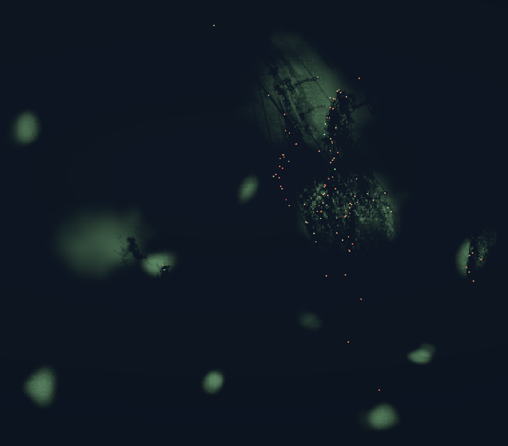
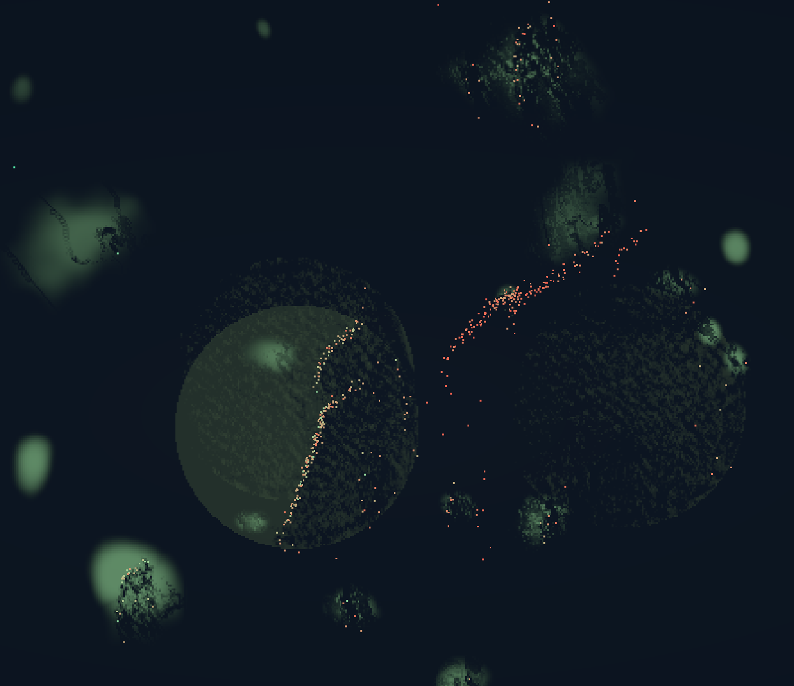

# Primitive World

A small artificial-life sandbox with no script for how to survive.



<details>
<summary>Another view of the world</summary>



</details>

Watch neural agents find food, reproduce, exchange signals and move one another.
They inherit fixed gated recurrent brains. A saved founding population and a
continuously varied candidate face the same environment. A candidate becomes the
current population as soon as it is still alive beyond the incumbent's natural
extinction time, and its living world keeps running. There is no learned selector.

The objective is worlds staying populated through continued ecological generations.
Random brains can fail quickly; selecting longer worlds does not establish
intelligence or cooperation.

## Play

Install Rust **1.93.1 or newer** and use a GPU/driver that supports wgpu compute.
Windows is the local build platform; this revision has static verification only. No Python, account,
model download, or server is required to play.

```sh
cargo run --release
```

On Windows, you can also double-click `Play.cmd`. It builds the current source
before opening it. The window shows the application version and world status.

**New Game and Load Game both retain evolution across worlds.** Fresh founders
have seed-specific random brains. Each paired comparison preserves the current
founding group unless its candidate produces a longer world. Every candidate
founder inherits an incumbent or terminal-descendant genome, then receives its
own continuously scaled mutation; no founder is copied unchanged or reset to a
fresh random brain. Memory gates, near/far regional senses and sector targeting
stay active. After a natural extinction, a sparse uniform sample of that world's
terminal descendant genomes can supply inherited sources for the next candidate.
The candidate still has to win the matched whole-world longevity comparison. See
the precise [inheritance rule](docs/evolution.md).

For the same evolutionary loop without rendering:

```sh
cargo run --release -- --headless --seed 42 --ticks 200000 --sample 1024 --output reports/evolution.json --save-checkpoint reports/evolution.checkpoint
```

Resume with new output paths:

```sh
cargo run --release -- --headless --checkpoint reports/evolution.checkpoint --ticks 200000 --output reports/continued.json --save-checkpoint reports/continued.checkpoint
```

Tick budgets pause headless work. The viewer saves automatically and exposes
pause, MAX speed, inspection, and load controls. See [evolution](docs/evolution.md)
for the selection rule and [performance](docs/performance.md) for clearly labelled earlier measurements and current limits.
Only the current save format loads. Noncurrent data is rejected without conversion or deletion.

**Expect early failures.** Random neural weights are not a competent starter
policy, nor random action sampling. Some agents repeat ineffective actions.
Selection takes generations, and improvement is not guaranteed.

## Things to try

- Start at 1x and click an agent to inspect its real inputs, energy, and decisions.
- Speed up to watch generations, population collapses, and recoveries.
- Choose physical costs and food growth in New Game to test evolution under pressure.
- Save and return to the same world, current/candidate founding groups, and search RNG state.
- Watch whether departures from depleted food lead to feeding and offspring elsewhere.

Space pauses; WASD/arrows pan; mouse wheel zooms; Home fits the world; L changes
the information lens. See the [play guide](docs/play.md) for saving and resuming.

## What evolves?

Every brain has **eight gated recurrent units, 108 inputs, and 20 outputs**:
1,188 inherited weights and biases. Structure is fixed. Parameters mutate at
paid births and when making next-world variants; they stay fixed during a life.
Private recurrent memory changes each tick and starts at zero in every new body.

Sensing and interactions are local. Body and brain upkeep share the metabolic
cost; fixed reproduction overhead covers construction. No structure upkeep,
copy-length tax, brain-controlled mutation, or online weight optimizer remains.

## Learn more

- [Play, controls, and saves](docs/play.md)
- [How evolution and carryover work](docs/evolution.md)
- [The agent’s inputs, memory, and outputs](docs/agents.md)
- [Physical and ecological rules](docs/world.md)
- [Headless observation and evidence limits](docs/observing.md)
- [Project direction and implementation priorities](docs/direction.md)
- [Contributing and verification](CONTRIBUTING.md)

The repository contains `src/`, `shaders/`, `docs/`, and optional `tools/`.
Your `runs/`, `reports/`, checkpoints, and build outputs are local data, not source.
See [release status](docs/release.md) for supported formats and distribution checks.
